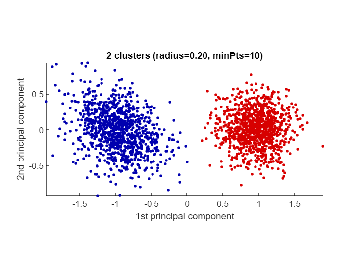
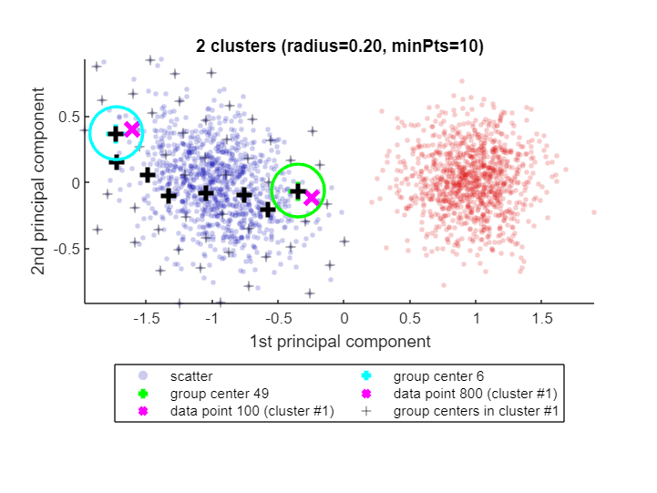
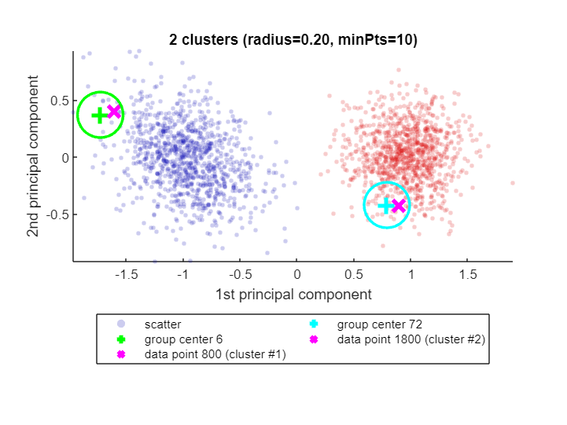
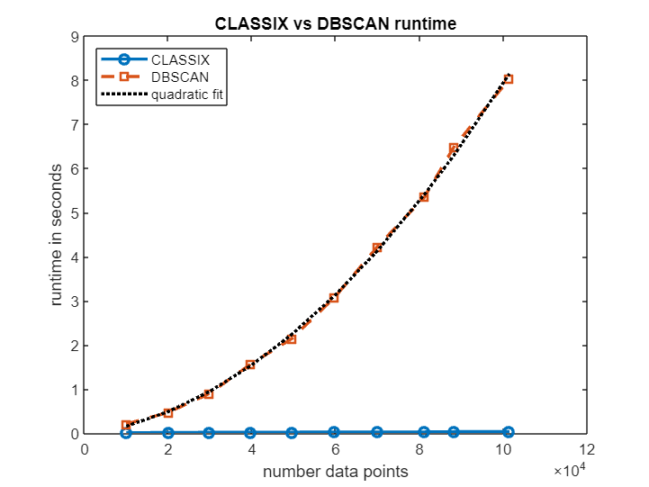

# <span style="color:rgb(213,80,0)">CLASSIX: Fast and explainable clustering in MATLAB</span>

[](https://matlab.mathworks.com/open/github/v1?repo=nla-group/classix-matlab&file=README.mlx) [](https://uk.mathworks.com/matlabcentral/fileexchange/153451-classix-fast-and-explainable-clustering)


CLASSIX is a fast and memory-efficient clustering method which provides textual and visual explanations of its clustering results.

# Basic usage

<samp>classix.m</samp> has three main input parameters: <samp>data, radius, minPts</samp> (optional). The data points to be clustered are provided as the rows of the matrix <samp>data</samp>. The <samp>radius</samp> parameter controls the *coarseness* of the clusters. Larger <samp>radius</samp> leads to fewer clusters. We usually recommend starting with <samp>radius=1</samp>, and then subsequently reducing it until the number of clusters is just a little larger than expected. The <samp>minPts</samp> parameter (default 1) can then be used to get rid of tiny clusters with fewer than <samp>minPts</samp> points. 


Let's demonstrate CLASSIX on an artificial dataset comprised of two Gaussian blobs. In the below test we choose <samp>radius=0.2</samp> and <samp>minPts=10</samp>.

```matlab
clear all
close all hidden
rng('default')                  % For reproducibility
mu1 = [2 2];                    % Mean of the 1st component
sigma1 = [2 0; 0 1];            % Covariance of the 1st component
mu2 = [-4 -3];                  % Mean of the 2nd component
sigma2 = [1 0; 0 1];            % Covariance of the 2nd component
r1 = mvnrnd(mu1,sigma1,1e3);
r2 = mvnrnd(mu2,sigma2,1e3);
data = [r1; r2];
tic
[label, explain, out] = classix(data, 0.2, 10); 
toc
```

```TextOutput
Elapsed time is 0.215595 seconds.
```

<samp>classix.m</samp> has three output parameters: <samp>label, explain, out</samp>. The vector <samp>label</samp> contains the cluster label of each data point. We can use it to produce a scatter plot via <samp>scatter(data(:,1),data(:,2),20,label)</samp>. But we don't actually have to do that manually: the <samp>explain</samp> function provides us with a textual summary of the performed clustering, and conveniently produces a scatter plot as well:

```matlab
explain()
```

```TextOutput
CLASSIX clustered 2000 data points with 2 features.
The radius parameter was set to 0.20 and MinPts was set to 10.
As the provided data was auto-scaled by a factor of 1/4.02,
points within a radius R=0.20*4.02=0.80 were grouped together.
In total, 12708 distances were computed (6.4 per data point).
This resulted in 93 groups, each with a unique starting point.
These 93 groups were subsequently merged into 2 clusters.
In order to explain the clustering of individual data points,
use explain(ind1) or explain(ind1,ind2) with indices of points.
```

<center></center>

# The explain() function

When called with one or two input arguments, the <samp>explain()</samp> function justifies why data points ended up in the same cluster, or not. Let's find out why data points 100 and 800 are in the same cluster:

```matlab
explain(100,800)
```

```TextOutput
Data point 100 is in group 49, which was merged into cluster #1.
Data point 800 is in group 6, which was merged into cluster #1.
A path of overlapping groups with step size <= 1.5*R = 1.21 is:
 49 -> 44 -> 38 -> 29 -> 18 -> 12 -> 7 -> 6
```

<center></center>


See how CLASSIX has highlighted the two data points 100 and 800 as magenta crosses (<samp>x</samp>) in the blue cluster (cluster #1). Each of these data points falls into a group (group number 49 and 6, respectively) and the group centers are shown as black pluses (<samp>+</samp>),with the green and cyan circles indicating the group radius. The size of the groups is controlled by CLASSIX's <samp>radius</samp> parameter, and two groups are considered as overlapping when their group centers are less than \texttt{1.5*R} apart. Overlapping groups are merged into clusters.


CLASSIX's explanation of why data both points are in the same cluster is that there is a path of overlapping groups leading from group 49 to group 6, and this path is also shown with black pluses (<samp>+</samp>). This feature simply uses MATLAB's <samp>shortestpath</samp> graph function. However, note that the path is not necessarily the shortest due to the sequential nature of the group merging. It is just *some* path of data points (group centers) within the cluster that connects the groups containing the two data points in question.


If there is no path of overlapping groups from one data point to the other, the data points are not in the same cluster. CLASSIX explains that as well:

```matlab
explain(800,1800)
```

```TextOutput
Data point 800 is in group 6, which was merged into cluster #1.
Data point 1800 is in group 72, which was merged into cluster #2.
There is no path of overlapping groups between 6 and 72.
```

<center></center>

# Is <samp>classix.m</samp> fast?

Yes, <samp>classix.m</samp> has been optimized for speed and low memory consumption, and can be even faster than the original Python CLASSIX implementation. Let's test CLASSIX on a slightly larger dataset, namely the <samp>'Phoneme'</samp> dataset from the UCI Machine Learning Repository (4509 data points, 256 features) [3]. We're using the 'optimal' hyperparameters determined via grid search in the CLASSIX paper [1]. We measure the quality of the clustering using the adjusted Rand index:

```matlab
ari = @(a,b) rand_index(double(a),double(b),'adjusted');
load('data/Phoneme.mat')
% z-normalization and parameters below chosen identically to the test in
% https://github.com/nla-group/classix/blob/master/exp/run_real_world.py
data = (data - mean(data))./std(data); 

tic
[label, explain, out] = classix(data,0.445,8);
fprintf('  CLASSIX.m runtime: %5.3f seconds - classes: %d - ARI: %3.2f\n',...
    toc, length(unique(label)), ari(labels,label))
```

```TextOutput
  CLASSIX.m runtime: 1.384 seconds - classes: 4 - ARI: 0.76
```

We also compare to MATLAB's DBSCAN [3]:

```matlab
%% MATLAB DBSCAN
tic
idx = dbscan(data,9.175,10); % Params determined by grid search. ARI should be 0.51.
fprintf('  DBSCAN runtime: %5.3f seconds - classes: %d - ARI: %3.2f\n',...
    toc, length(unique(idx)), ari(labels,idx))
```

```TextOutput
  DBSCAN runtime: 0.412 seconds - classes: 5 - ARI: 0.51
```

On this dataset, DBSCAN isn't able to achieve an ARI as high as CLASSIX. We have made efforts to choose the best parameters for both methods, though of course one can never be certain they are actually the best possible. In any case, <samp>classix.m</samp> is only a small factor slower than DBSCAN for this dataset, even though DBSCAN is fully implemented in C++.

# CLASSIX on very large datasets

CLASSIX becomes very powerful for extremely large datasets (i.e., many data points) of not too high dimension. Here's an example with more than 2 millions data points for which CLASSIX returns a reasonably looking clustering in half a second:

```matlab
load('data/vdu_signals_single.mat')
data = double(data);
data = (data - mean(data))./std(data); 
% no ground truth labels for this dataset

%% classix.m - clustering more than 2M data points
tic
[label, explain] = classix(data, 0.4, 6);
fprintf('  CLASSIX runtime: %5.3f seconds - classes: %d\n',...
    toc, length(unique(label)))
```

```TextOutput
  CLASSIX runtime: 0.512 seconds - classes: 7
```

```matlab
explain()
```

```TextOutput
CLASSIX clustered 2028780 data points with 2 features.
The radius parameter was set to 0.40 and MinPts was set to 6.
As the provided data was auto-scaled by a factor of 1/0.92,
points within a radius R=0.40*0.92=0.37 were grouped together.
In total, 17209578 distances were computed (8.5 per data point).
This resulted in 97 groups, each with a unique starting point.
These 97 groups were subsequently merged into 7 clusters.
In order to explain the clustering of individual data points,
use explain(ind1) or explain(ind1,ind2) with indices of points.
Too many data points for plot. Randomly subsampled 1e5 points.
```

<center></center>


Let's compare to DBSCAN again. In order to run DBSCAN in reasonable time, we downsample to 5% of the data. The hyperparameters are chosen to approximately match the clustering results of CLASSIX.

```matlab
%% MATLAB DBSCAN
%  We cluster only 5% of the data.
tic
idx = dbscan(data(1:20:end,:), 0.7, 6);  % subsample
fprintf('  DBSCAN runtime (5%% of data): %6.3f seconds - classes: %d\n',...
    toc,length(unique(idx)))
```

```TextOutput
  DBSCAN runtime (5% of data):  8.917 seconds - classes: 5
```
# Scaling test: CLASSIX vs DBSCAN

Let's see how the runtimes of CLASSIX and DBSCAN scale as the number of data points increases. The plot below shows that, over a range of data sizes from 10k to 100k, CLASSIX's runtime remains in the order of milliseconds, while DBSCAN's runtime grows approximately quadratically until it requires several seconds. The extrapolated DBSCAN runtime on the full dataset with all 2 million points would be about 1 hour. (Timings from MATLAB Online. The precise numbers depend on the machine.)

```matlab
npts = 10000:10000:100000;
t_classix = []; t_dbscan = [];
for j = 1:length(npts)
    s = round(size(data,1)/npts(j));
    dat = data(1:s:end,:);
    npts(j) = size(dat,1);
    fprintf('# of data points: %d', size(dat,1))
    tic; label = classix(dat, 0.4, 6); t_classix(j) = toc;
    fprintf('  CLASSIX runtime: %6.3f seconds - classes: %d\n', t_classix(j), length(unique(label)));
    tic; idx = dbscan(dat, 0.7, 6); t_dbscan(j) = toc;
    fprintf('  DBSCAN  runtime: %6.3f seconds - classes: %d\n', t_dbscan(j), length(unique(idx)))
end
```

```TextOutput
# of data points: 9994
  CLASSIX runtime:  0.007 seconds - classes: 4
  DBSCAN  runtime:  0.221 seconds - classes: 5
# of data points: 20087
  CLASSIX runtime:  0.009 seconds - classes: 4
  DBSCAN  runtime:  0.538 seconds - classes: 4
# of data points: 29835
  CLASSIX runtime:  0.014 seconds - classes: 4
  DBSCAN  runtime:  1.014 seconds - classes: 5
# of data points: 39780
  CLASSIX runtime:  0.020 seconds - classes: 5
  DBSCAN  runtime:  1.538 seconds - classes: 6
# of data points: 49483
  CLASSIX runtime:  0.019 seconds - classes: 7
  DBSCAN  runtime:  2.559 seconds - classes: 5
# of data points: 59670
  CLASSIX runtime:  0.031 seconds - classes: 5
  DBSCAN  runtime:  3.811 seconds - classes: 5
# of data points: 69958
  CLASSIX runtime:  0.029 seconds - classes: 6
  DBSCAN  runtime:  4.498 seconds - classes: 7
# of data points: 81152
  CLASSIX runtime:  0.031 seconds - classes: 7
  DBSCAN  runtime:  5.905 seconds - classes: 6
# of data points: 88208
  CLASSIX runtime:  0.025 seconds - classes: 9
  DBSCAN  runtime:  7.105 seconds - classes: 6
# of data points: 101439
  CLASSIX runtime:  0.050 seconds - classes: 8
  DBSCAN  runtime:  9.427 seconds - classes: 5
```

```matlab
figure
plot(npts,t_classix,'-o','LineWidth',2), hold on
plot(npts,t_dbscan,'--s','LineWidth',2)
p = polyfit(npts, t_dbscan, 2);
plot(npts,polyval(p, npts),'k:','LineWidth',2)
legend('CLASSIX','DBSCAN','quadratic fit','Location','northwest')
xlabel('number data points'); ylabel('runtime in seconds'); 
title('CLASSIX vs DBSCAN runtime')
```

<center></center>


```matlab
fprintf('Extrapolated DBSCAN runtime for all %d datapoints: %3.1f minutes.',size(data,1),polyval(p,size(data,1))/60)
```

```TextOutput
Extrapolated DBSCAN runtime for all 2028780 datapoints: 56.2 minutes.
```
# Learn more about CLASSIX?

CLASSIX is a fast and memory-efficient clustering algorithm which produces explainable results. If you'd like to learn more, here are a couple of online resources:

-  arXiv paper: [https://arxiv.org/abs/2202.01456](https://arxiv.org/abs/2202.01456) 
-  Python code: [https://github.com/nla-group/classix](https://github.com/nla-group/classix) 
-  MATLAB code: [https://github.com/nla-group/classix-matlab/](https://github.com/nla-group/classix-matlab/) 
-  YouTube video: [https://www.youtube.com/watch?v=K94zgRjFEYo](https://www.youtube.com/watch?v=K94zgRjFEYo) 

This documentation has been generated from the MATLAB Live Script <samp>README.mlx</samp>. You can open it in MATLAB Online and explore CLASSIX interactively: [](https://matlab.mathworks.com/open/github/v1?repo=nla-group/classix-matlab&file=README.mlx)

# Contributors

This CLASSIX implementation is maintained by Xinye Chen (Charles University Prague), Mike Croucher (MathWorks), and Stefan Güttel (University of Manchester). If you find CLASSIX useful in your work, please consider citing our paper [1]. If you have any problems or questions, just drop us an email: <samp>stefan.guettel@manchester.ac.uk</samp>

# References

[1] X. Chen and S. Güttel. "Fast and explainable clustering based on sorting." arXiv: [https://arxiv.org/abs/2202.01456](https://arxiv.org/abs/2202.01456), 2022.


[2] D. Dua and C. Graff. "UCI machine learning repository." URL: [http://archive.ics.uci.edu/ml](http://archive.ics.uci.edu/ml), 2017.


[3] M. Ester, H.-P. Kriegel, J. Sander, and X. Xiaowei. "A density-based algorithm for discovering clusters in large spatial databases with noise." In *Proceedings of the Second International Conference on Knowledge Discovery in Databases and Data Mining*, pages 226-231, 1996.

