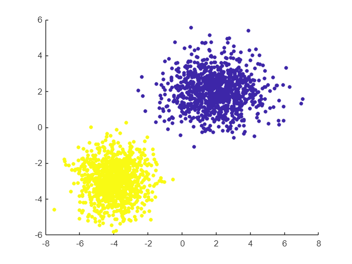
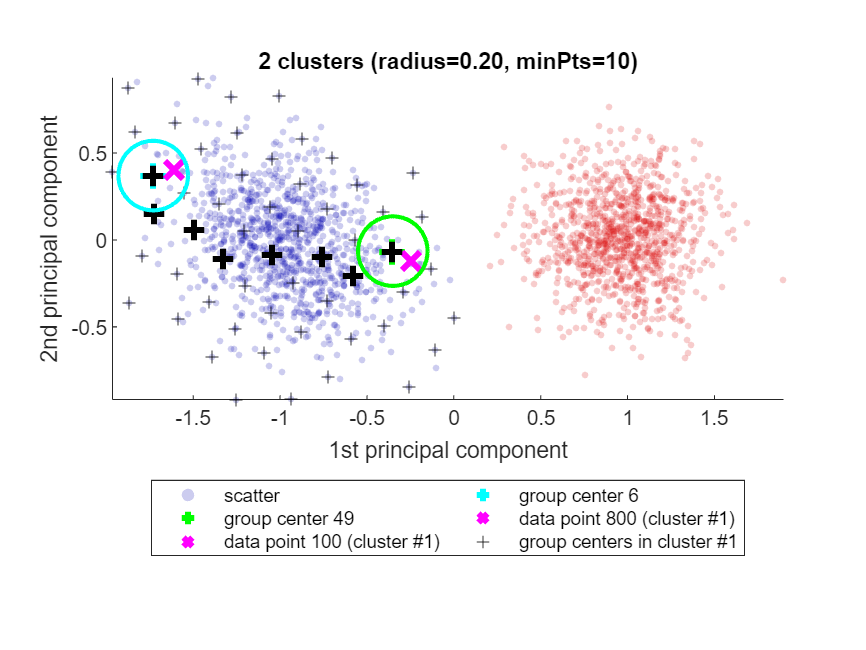
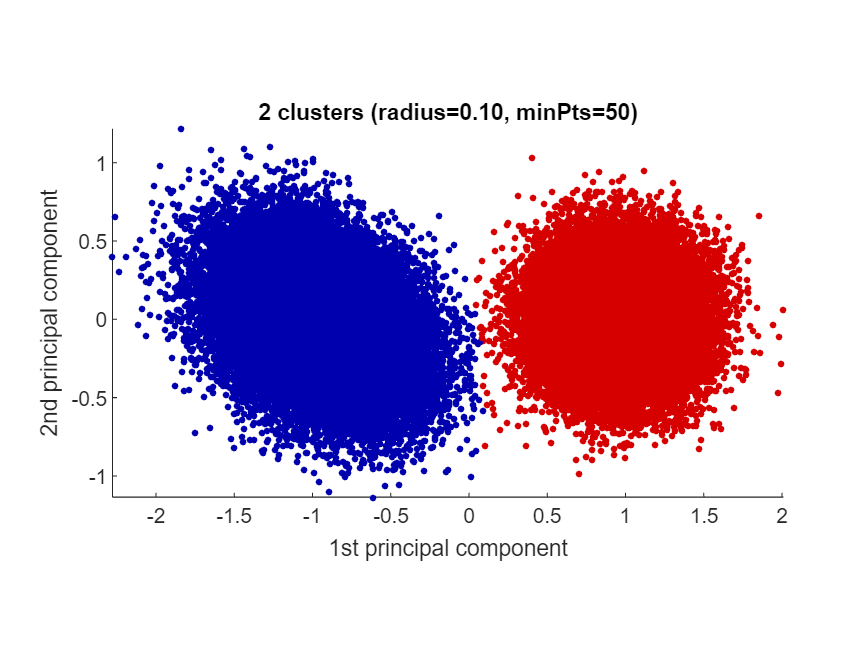
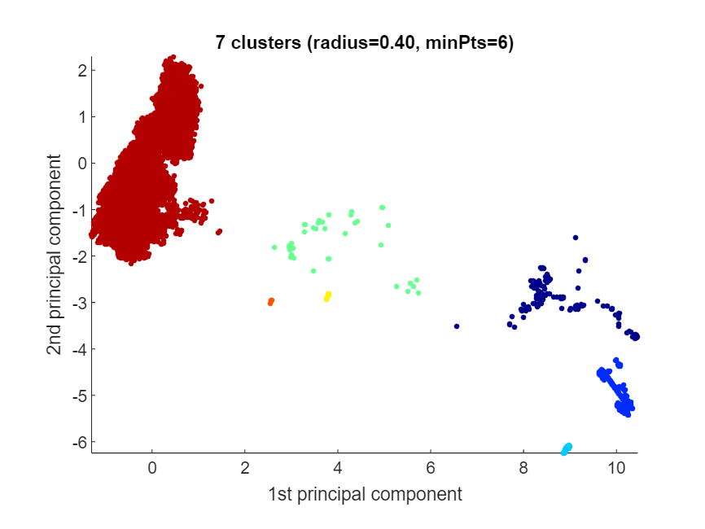
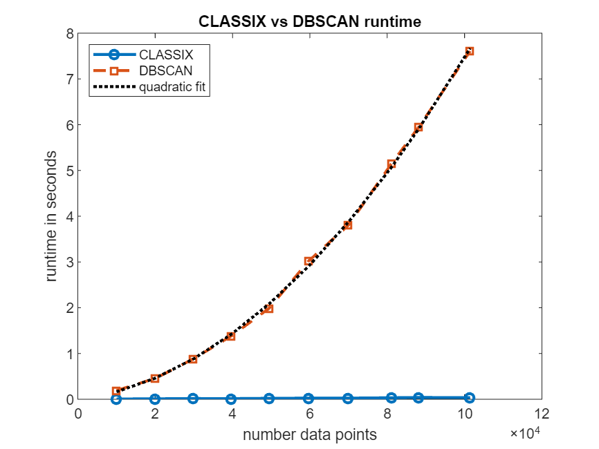

# A CLASSIX implementation for MATLAB


CLASSIX is a fast and memory-efficient clustering algorithm which provides textual and visual explanations of its clustering results [1]. In contrast to clustering methods like DBSCAN, CLASSIX does not use any tree-based data structures to perform nearest-neighbor searches (its memory requirement grows essentially linearly in the number of data points). In contrast to the popular k-means algorithm, which is tailored to spherical clusters, CLASSIX can detect clusters of arbitrary shape. 


# Basic usage


The MATLAB file `classix.m` fully implements all essential CLASSIX features available in the Python implementation. And using it is very straightforward. Let's demonstrate this on an artificial dataset comprised of two Gaussian blobs in 2D. 


CLASSIX accepts three essential input parameters: `data, radius, minPts` (optionally). The data points to be clustered are provided as the rows of the matrix `data`, that is, 


`data` is of size (number of data points)-by-(number of features). 


The `radius` parameter controls the *coarseness* of the clusters. The higher it is, larger the clusters will be. We usually recommend starting with a value like `radius=1`, and then subsequently reducing it until the number of clusters is just a little larger than expected. The second `minPts` parameter (default 1) can then be used to get rid of tiny clusters with fewer than `minPts` points. In the below test we choose` radius=0.2` and `minPts=10.`


```matlab:Code
clear all
close all hidden
rng('default')                  % For reproducibility
mu1 = [2 2];                    % Mean of the 1st component
sigma1 = [2 0; 0 1];            % Covariance of the 1st component
mu2 = [-4 -3];                  % Mean of the 2nd component
sigma2 = [1 0; 0 1];            % Covariance of the 2nd component
r1 = mvnrnd(mu1,sigma1,1e3);
r2 = mvnrnd(mu2,sigma2,1e3);
data = [r1; r2];
tic
[label, explain, out] = classix(data, 0.2, 10); 
toc
```


```text:Output
Elapsed time is 0.060389 seconds.
```


`classix.m` has three output parameters: `label, explain, out`. The first one, the vector `label`, contains the cluster label of each data point. We can use it to produce a scatter plot via `scatter(data(:,1),data(:,2),20,label,"filled")`. But we actually don't have to do that manually: the `explain` function provides us with a textual summary of the performed clustering, and conveniently produces a scatter plot as well:


```matlab:Code
explain()
```


```text:Output
A clustering of 2000 data points with 2 features was performed.
The radius parameter was set to 0.20 and MinPts was set to 10.
As the provided data was auto-scaled by a factor of 1/4.02,
points within a radius R=0.20*4.02=0.80 were grouped together.
In total, 12708 distances were computed (6.4 per data point).
This resulted in 93 groups, each with a unique starting point.
These 93 groups were subsequently merged into 2 clusters.
In order to explain the clustering of individual data points,
use explain(ind1) or explain(ind1,ind2) with indices of points.
```




# The explain() function


When called with one or two input arguments, the `explain` function justifies why data points ended up in the same cluster, or not. For example, let's find out why data points 100 and 800 ended up in the same cluster:


```matlab:Code
explain(100,800)
```


```text:Output
Data point 100 is in group 49, which was merged into cluster #1.
Data point 800 is in group 6, which was merged into cluster #1.
A path of overlapping groups with step size <= 1.5*R = 1.21 is:
 49 -> 44 -> 38 -> 29 -> 18 -> 12 -> 7 -> 6
```





See how CLASSIX has highlighted the two data points 100 and 800 as magenta crosses (`x`) in the blue cluster (cluster \#1). Each of these data points falls into a group (group number 49 and 6, respectively) and the group centers are shown as black pluses (`+`),with the green and cyan circles indicating the group radius. The size of the groups is controlled by CLASSIX's `radius` parameter, and two groups are considered as overlapping when their group centers are less than\texttt{ 1.5*R }apart. Overlapping groups are merged into clusters.


CLASSIX's explanation of why data both points are in the same cluster is that there is a path of overlapping groups leading from group 49 to group 6, and this path is also shown with black pluses (`+`). This feature simply uses MATLAB's `shortestpath` graph function. However, note that the path is not necessarily the shortest due to the sequential nature of the group merging. It is just *some* path of data points (group centers) within the cluster that connects the groups containing the two data points in question.


If there is no path of overlapping groups from one data point to the other, the data points are not in the same cluster. CLASSIX explains that as well:


```matlab:Code
explain(800,1800)
```


```text:Output
Data point 800 is in group 6, which was merged into cluster #1.
Data point 1800 is in group 72, which was merged into cluster #2.
There is no path of overlapping groups between 6 and 72.
```


# An experimental option


We have added a new experimental option to `classix.m,` namely a fourth input parameter called `merge_tiny_groups`. This parameter is `true` by default, resulting in the original CLASSIX method [1]. But when it is set to `false`, tiny groups with fewer than `minPts` points will be ignored in the merging phase and become stand-alone clusters first, before they are subsequently merged into a nearest bigger cluster. (That's different from the usual `minPts` criterion which applies to the size of clusters, not the size of individual groups.) This option can sometimes overcome 'creeping' between small groups, whereby clusters get merged simply because they are touched by low density groups. This allows us to cluster Gaussian blobs even when they are visibly intersecting.


```matlab:Code
rng('default')                   
r1 = mvnrnd(mu1,sigma1,1e5);   % Much larger number of data points!
r2 = mvnrnd(mu2,sigma2,1e5);
data = [r1; r2];
tic;
[label, explain, out] = classix(data, 0.1, 50, 0);  % note the final 0 option
toc
```


```text:Output
Elapsed time is 0.161977 seconds.
```


```matlab:Code
explain()
```


```text:Output
A clustering of 200000 data points with 2 features was performed.
The radius parameter was set to 0.10 and MinPts was set to 50.
As the provided data was auto-scaled by a factor of 1/4.05,
points within a radius R=0.10*4.05=0.41 were grouped together.
In total, 3664460 distances were computed (18.3 per data point).
This resulted in 635 groups, each with a unique starting point.
These 635 groups were subsequently merged into 2 clusters.
In order to explain the clustering of individual data points,
use explain(ind1) or explain(ind1,ind2) with indices of points.
Too many data points for plot. Randomly subsampled 1e5 points.
```




# Is `classix.m` fast?


Yes, `classix.m` has been optimized for speed and low memory consumption, and can be even faster than the original Python CLASSIX implementation. Let's test CLASSIX on a slightly larger dataset, namely the `'Phoneme'` dataset from the UCI Machine Learning Repository (4509 data points, 256 features) [3]. We're using the 'optimal' hyperparameters determined via grid search in the CLASSIX paper [1]. We measure the quality of the clustering using the adjusted Rand index.


```matlab:Code
ari = @(a,b) rand_index(double(a),double(b),'adjusted');
load Phoneme.mat
% z-normalization and parameters chosen identical to the test in
% https://github.com/nla-group/classix/blob/master/exp/run_real_world.py
data = (data - mean(data))./std(data); 

tic
[label, explain, out] = classix(data,0.445,8);
fprintf('  CLASSIX.m runtime: %5.3f seconds - classes: %d - ARI: %3.2f\n',...
    toc,length(unique(label)), ari(labels,label))
```


```text:Output
  CLASSIX.m runtime: 1.169 seconds - classes: 4 - ARI: 0.76
```


```matlab:Code
explain()
```


We can also compare to MATLAB's DBSCAN [3]:


```matlab:Code
%% MATLAB DBSCAN
tic
idx = dbscan(data,9.175,10); % Also determined by grid search. ARI should be 0.51.
fprintf('  DBSCAN   runtime: %5.3f seconds - classes: %d - ARI: %3.2f\n',...
    toc,length(unique(idx)), ari(labels,idx))
```


```text:Output
  DBSCAN   runtime: 0.332 seconds - classes: 5 - ARI: 0.51
```


On this dataset, DBSCAN isn't able to achieve an ARI as high as CLASSIX. We have made efforts to choose the best parameters for DBSCAN, though of course one can never be certain they are actually the best possible. In any case, `classix.m` is only a small factor slower than DBSCAN for this dataset, even though DBSCAN is fully implemented in C++.


# CLASSIX on very large datasets


CLASSIX becomes very powerful in particular for extremely large datasets (i.e., many data points) of not too high dimension. Here's an example with more than 2 millions data points for which CLASSIX returns a reasonably looking clustering in half a second:


```matlab:Code
load vdu_signals_single.mat
data = double(data);
data = (data - mean(data))./std(data); 
% no ground truth labels for this dataset

%% classix.m - clustering more than 2M data points
tic
[label, explain] = classix(data, 0.4, 6);
fprintf('  CLASSIX runtime: %5.3f seconds - classes: %d\n',...
    toc, length(unique(label)))
```


```text:Output
  CLASSIX runtime: 0.567 seconds - classes: 7
```


```matlab:Code
explain()
```


```text:Output
A clustering of 2028780 data points with 2 features was performed.
The radius parameter was set to 0.40 and MinPts was set to 6.
As the provided data was auto-scaled by a factor of 1/0.92,
points within a radius R=0.40*0.92=0.37 were grouped together.
In total, 17209578 distances were computed (8.5 per data point).
This resulted in 97 groups, each with a unique starting point.
These 97 groups were subsequently merged into 7 clusters.
In order to explain the clustering of individual data points,
use explain(ind1) or explain(ind1,ind2) with indices of points.
Too many data points for plot. Randomly subsampled 1e5 points.
```





Let us compare to DBSCAN. In order to run DBSCAN to completion in reasonable time, we need to downsample to 5% of the data. The hyperparameters are chosen to approximately match the clustering results from CLASSIX.


```matlab:Code
%% MATLAB DBSCAN
%  We cluster only 5% of the data with DBSCAN
tic
idx = dbscan(data(1:20:end,:), 0.7, 6);   % subsample to 5% of data
fprintf('  DBSCAN   runtime: %6.3f seconds - classes: %d\n',...
    toc,length(unique(idx)))
```


```text:Output
  DBSCAN   runtime:  7.936 seconds - classes: 5
```

# Scaling test: CLASSIX vs DBSCAN


Running DBSCAN on all 2 million data points of the `vdu_signals` dataset is not feasible. Let's see how the runtimes of CLASSIX and DBSCAN scale as the number of data points increases. The plot below shows that, over a range of data sizes from 10k to 100k, CLASSIX's runtime remains in the order of milliseconds, while DBSCAN's runtime grows approximately quadratically until it requires several seconds. The extrapolated DBSCAN runtime on the full dataset with all 2 million points would be about 45 minutes. (Timings on MATLAB Online. The precise numbers depend on the machine.)


```matlab:Code
npts = 10000:10000:100000;
t_classix = []; t_dbscan = [];
for j = 1:length(npts)
    s = round(size(data,1)/npts(j));
    dat = data(1:s:end,:);
    npts(j) = size(dat,1);
    fprintf('# of data points: %d', size(dat,1))
    tic; label = classix(dat, 0.4, 6); t_classix(j) = toc;
    fprintf('  CLASSIX runtime: %6.3f seconds - classes: %d\n', t_classix(j), length(unique(label)));
    tic; idx = dbscan(dat, 0.7, 6); t_dbscan(j) = toc;
    fprintf('  DBSCAN  runtime: %6.3f seconds - classes: %d\n', t_dbscan(j), length(unique(idx)))
end
```


```text:Output
# of data points: 9994
  CLASSIX runtime:  0.006 seconds - classes: 4
  DBSCAN  runtime:  0.190 seconds - classes: 5
# of data points: 20087
  CLASSIX runtime:  0.010 seconds - classes: 4
  DBSCAN  runtime:  0.457 seconds - classes: 4
# of data points: 29835
  CLASSIX runtime:  0.016 seconds - classes: 4
  DBSCAN  runtime:  0.882 seconds - classes: 5
# of data points: 39780
  CLASSIX runtime:  0.014 seconds - classes: 5
  DBSCAN  runtime:  1.387 seconds - classes: 6
# of data points: 49483
  CLASSIX runtime:  0.020 seconds - classes: 7
  DBSCAN  runtime:  1.989 seconds - classes: 5
# of data points: 59670
  CLASSIX runtime:  0.024 seconds - classes: 5
  DBSCAN  runtime:  3.021 seconds - classes: 5
# of data points: 69958
  CLASSIX runtime:  0.025 seconds - classes: 6
  DBSCAN  runtime:  3.804 seconds - classes: 7
# of data points: 81152
  CLASSIX runtime:  0.033 seconds - classes: 7
  DBSCAN  runtime:  5.152 seconds - classes: 6
# of data points: 88208
  CLASSIX runtime:  0.038 seconds - classes: 9
  DBSCAN  runtime:  5.955 seconds - classes: 6
# of data points: 101439
  CLASSIX runtime:  0.036 seconds - classes: 8
  DBSCAN  runtime:  7.609 seconds - classes: 5
```


```matlab:Code
figure
plot(npts,t_classix,'-o','LineWidth',2)
hold on
plot(npts,t_dbscan,'--s','LineWidth',2)
p = polyfit(npts, t_dbscan, 2);
plot(npts,polyval(p, npts),'k:','LineWidth',2)
legend('CLASSIX','DBSCAN','quadratic fit', 'Location','northwest')
xlabel('number data points'); ylabel('runtime in seconds'); title('CLASSIX vs DBSCAN runtime')
```





```matlab:Code
fprintf('Extrapolated DBSCAN runtime for all %d datapoints: %3.1f minutes.',size(data,1),polyval(p,size(data,1))/60)
```


```text:Output
Extrapolated DBSCAN runtime for all 2028780 datapoints: 44.4 minutes.
```

# Learn more about CLASSIX?


CLASSIX is a fast and memory-efficient clustering algorithm which produces explainable results. If you'd like to learn more about CLASSIX, here are a couple of online resources:


   -  arXiv paper: [Fast and explainable clustering based on sorting (arxiv.org)](https://arxiv.org/abs/2202.01456) 
   -  Python code: [Fast and explainable clustering based on sorting (github.com)](https://github.com/nla-group/classix) 
   -  YouTube video: [CLASSIX - Fast and explainable clustering based on sorting - YouTube](https://www.youtube.com/watch?v=K94zgRjFEYo) 

# Contributors


This MATLAB CLASSIX implementation is maintained by Xinye Chen (Charles University Prague), Mike Croucher (MathWorks), and Stefan Güttel (University of Manchester). If you find CLASSIX useful in your work, please consider citing the below reference [1]. If you have any problems or questions, just drop us an email to `stefan.guettel@manchester.ac.uk`.


# MATLAB Online


This documentation has been generated from the MATLAB live script README.mlx. You can try this link to open it in MATLAB Online: [https://matlab.mathworks.com/open/github/v1?repo=nla-group/classix-matlab\&file=README.mlx](https://matlab.mathworks.com/open/github/v1?repo=nla-group/classix-matlab&file=README.mlx) 


# References


[1] C. Chen and S. Güttel. "Fast and explainable clustering based on sorting." arXiv: [https://arxiv.org/abs/2202.01456](https://arxiv.org/abs/2202.01456), 2022.


[2] D. Dua and C. Graff. "UCI machine learning repository." URL: [http://archive.ics.uci.edu/ml](http://archive.ics.uci.edu/ml), 2017.


[3] M. Ester, H.-P. Kriegel, J. Sander, and X. Xiaowei. "A density-based algorithm for discovering clusters in large spatial databases with noise." In *Proceedings of the Second International Conference on Knowledge Discovery in Databases and Data Mining*, pages 226-231, 1996.


  

<br><br>
<p align="left">
  <a>
    
  </a>
</p>
